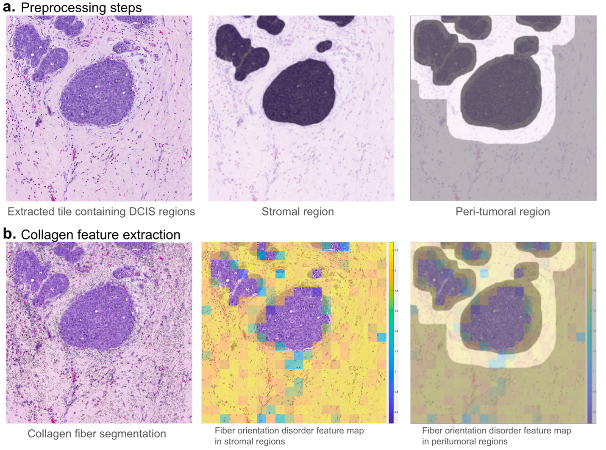

# Collagen Biomarker

---

## Authors
Arpit Aggarwal, Himanshu Maurya, Haojia Li, and Anant Madabhushi 

## Packages Required
Python was used for this study. 
The packages required for running this code are PyTorch, Numpy, Openslide, PIL, OpenCV, Pandas, Sklearn, and Matplotlib. 

## Workflow for the study

## Pipeline for Collagen biomarker
The main steps involved in the Collagen biomarker are as follows:
1. Preprocessing steps (Extracting tiles from H&E-stained Whole Slide Images and Epithelium/Stroma segmentation)
2. Extracting collagen features

## Running the code
1. <b>Preprocessing steps</b> 
a. <b>Extracting tiles from H&E-stained Whole Slide Images</b> - This extracts tiles from the whole slide image of size 3000x3000-pixel. Run the python file 'python3 code/extract_patches.py' (specify the 'input_path' to the location where whole slide images exist and 'output_path' where you want to store the tiles (keep it 'data/patches')). 

b. <b>Epithelium/Stroma segmentation</b> - To segment the epithelium/stromal regions on the tiles extracted above, run the pretrained epithelium/stroma model 'python3 code/epithelium_stroma_segmentation.py'. The model weights file is located at 'code/epi_seg_unet.pth' (specify the 'input_path' to the location where tiles are extracted and 'output_path' where you want to store the epithelium/stroma segmentation masks (keep it 'data/masks')). 

2. <b>Extracting collagen features</b> 
As described in the manuscript, for extracting the collagen features run the file (code/main_patchLevelFeatures.py) that generates the Collagen Fiber Orientation Disorder map for each tile extracted. The feature maps will be stored over here 'results/patches'.
  
After obtaining the feature maps for each tile, run the file (code/main_patientLevelFeatures.py) that gives patient-level features (mean and maximum) for each patient, giving a total of 36 features. The features for each patient will be stored over here 'results/features' which can be used for downstream tasks like survival analysis etc.  

## License and Usage
Madabhushi Lab - This code is made available under Apache 2.0 with Commons Clause License and is available for non-commercial academic purposes.